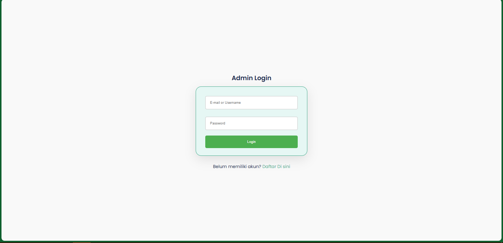
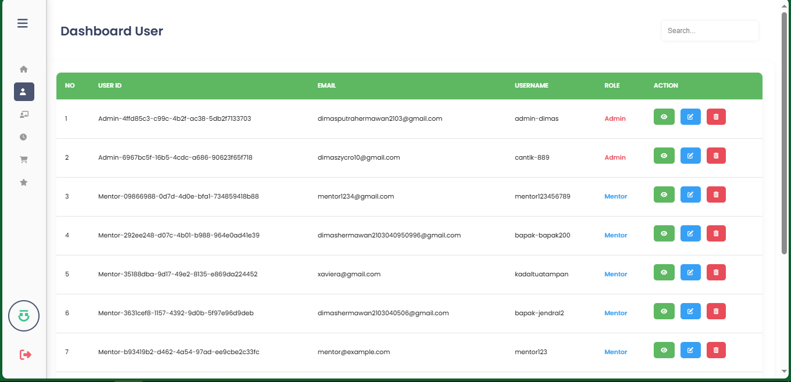
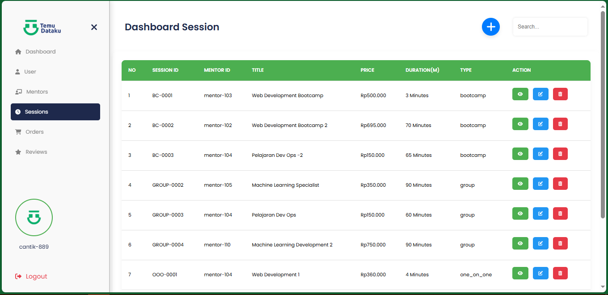
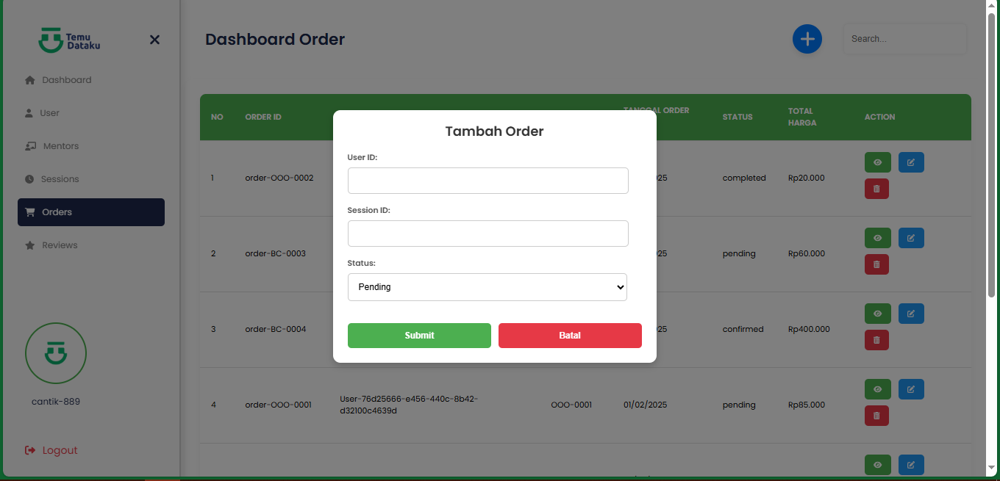
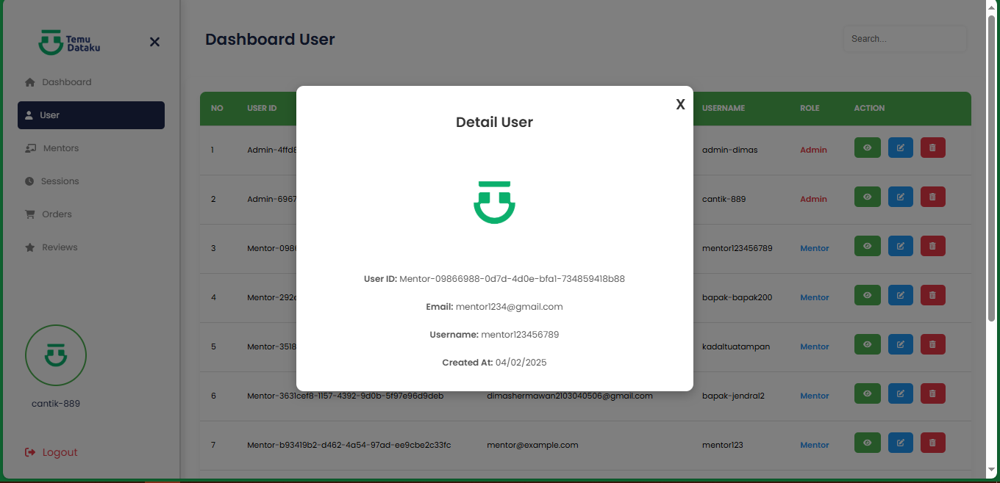

# TemuDataku

__TemuDataku__ adalah aplikasi berbasis web yang digunakan sebagai platform untuk mentoring terkait data, seperti data science, data analyst, dan machine learning. Aplikasi ini dibangun dengan arsitektur full-stack menggunakan MySQL sebagai database, Node.js dengan Express sebagai backend, dan React sebagai frontend. Berikut adalah deskripsi lebih detail mengenai teknologi yang digunakan dan fitur-fitur yang disediakan oleh TemuDataku.

## Teknologi yang digunakan
- __MySQL__ : Digunakan untuk menyimpan dan mengelola data aplikasi seperti informasi pengguna, data mentor, sesi mentoring, dan riwayat pembelajaran. Struktur database dirancang untuk mendukung skala besar dan memastikan data dapat diakses secara efisien.
- __Node.js dengan Express__ : Sebagai backend, Node.js dan Express bertanggung jawab atas API server untuk menangani permintaan dari frontend, autentikasi pengguna, validasi data, dan komunikasi dengan database MySQL.
- __React.JS__ : Digunakan sebagai frontend untuk menyediakan antarmuka pengguna yang responsif dan interaktif. React memastikan pengalaman yang cepat dan mulus dengan manajemen komponen yang efisien.

## Fitur Utama
1. __Autentikasi Pengguna__ : Pendaftaran dan login pengguna dengan validasi yang aman untuk melindungi data.
2. __Dashboard Pengguna__ : Setiap pengguna memiliki halaman profil dan dasbor untuk mengelola riwayat sesi mentoring, pencarian mentor, dan jadwal sesi.
3. __Pencarian Mentor__ : Pengguna dapat mencari mentor berdasarkan bidang keahlian seperti data science, data analysis, atau machine learning.
4. __Penjadwalan Sesi Mentoring__ : Pengguna dapat membuat sesi mentoring dengan mentor sesuai jadwal yang tersedia dan memilih jenis sesi seperti one-on-one atau grup.
5. __Rating dan Ulasan Mentor__ : Pengguna dapat memberikan rating dan ulasan untuk mentor setelah sesi selesai.
6. __Riwayat Mentoring__ : Setiap sesi mentoring dicatat, dan pengguna dapat melihat riwayat sesi yang telah dilakukan.
7. __Pembayaran Aman__ : Mendukung transaksi pembayaran untuk sesi mentoring dengan berbagai metode yang aman.

## Instalasi dan Penggunaan
### Persiapan
Pastikan Anda sudah menginstal Node.js, MySQL, dan NPM di lingkungan Anda.
### Langkah-Langkah Instalasi
1. __Clone Repository__
   ```
   git clone https://github.com/zycro21/temudataku.git
   cd temudataku
   ```
2. __Set Up BackEnd__
   * Pindah ke direktori `server_backend`:
   ```
   cd server_backend
   ```
   * Install dependencies :
   ```
   npm install
   ```
   * Atur konfigurasi database di file `.env` dan jalankan server backend
   ```
   npm start
   ```
3. __Set Up FrontEnd__
   * Pindah ke direktori `frontend_client/temudataku` :
   ```
   cd ../frontend_client/temudataku
   ```
   * Install dependencies :
   ```
   npm install
   ```
   * Jalankan aplikasi React
   ```
   npm start
   ```

### Struktur Folder
- `frontend_client` : Berisi source code untuk frontend aplikasi (React).
- `server_backend` : Berisi source code untuk backend aplikasi (Node.js dan Express).
- file `database(sementara).zip`: Struktur database yang digunakan dalam project ini (isinya data dummy) dalam format.

### API Documentation
https://documenter.getpostman.com/view/26430352/2sAYX3sioQ

### Example Page:




